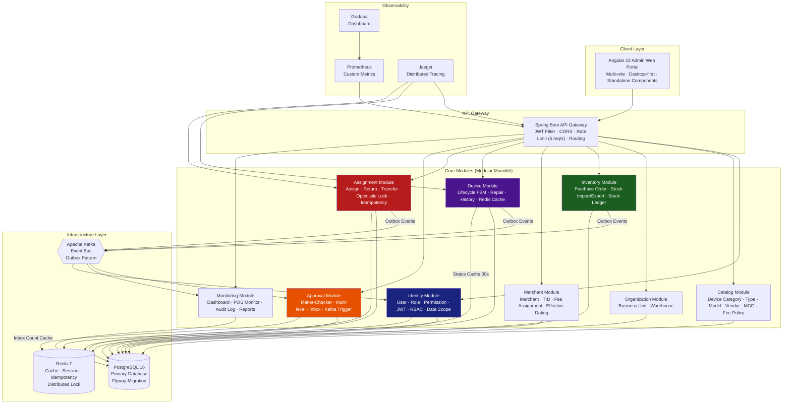
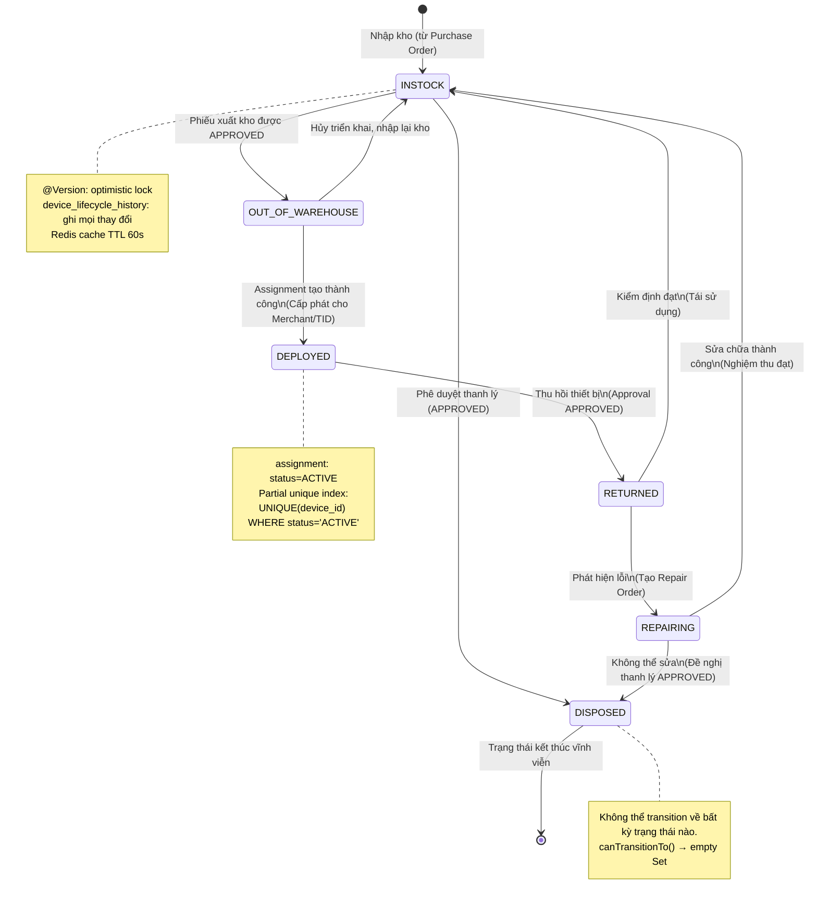
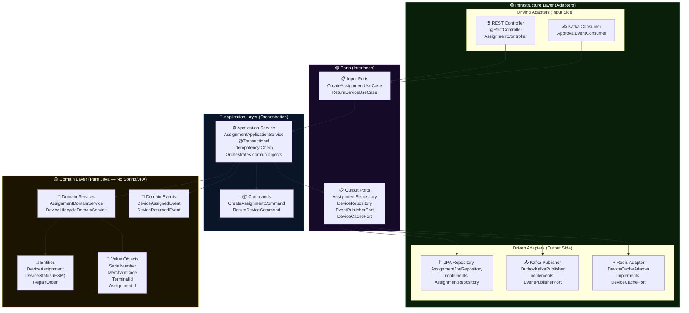
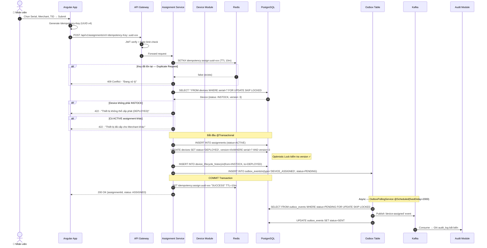
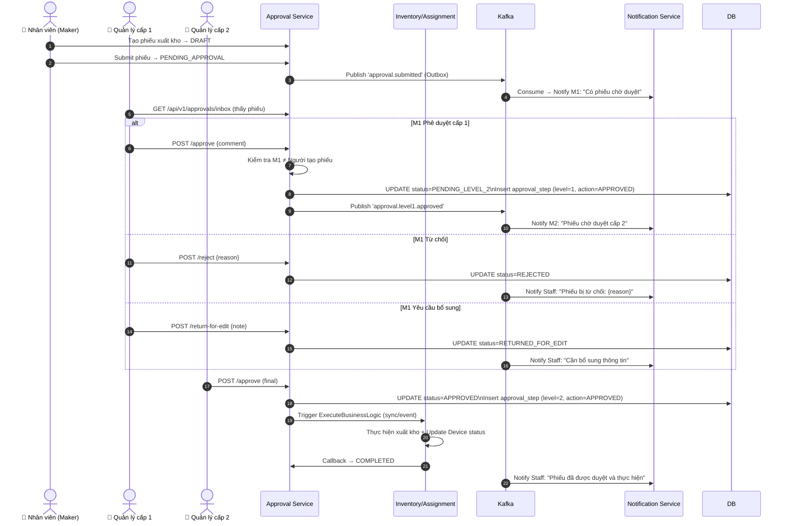
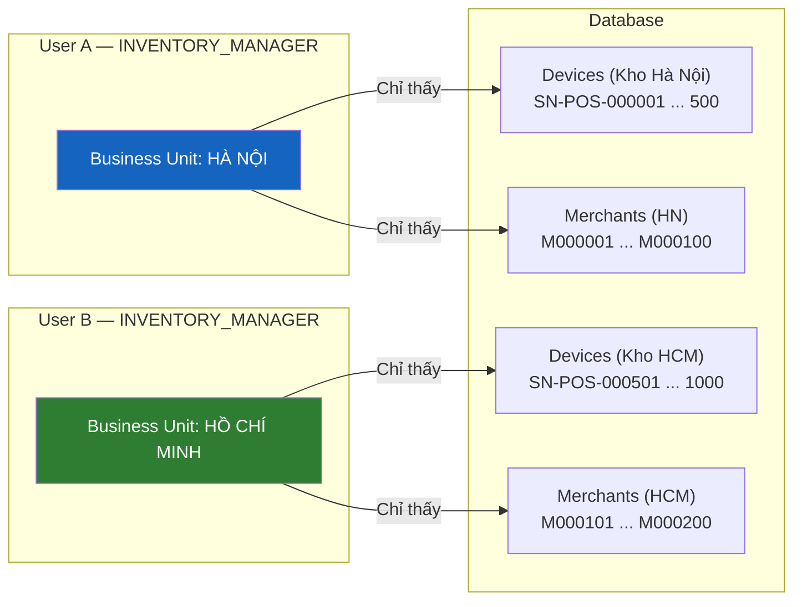
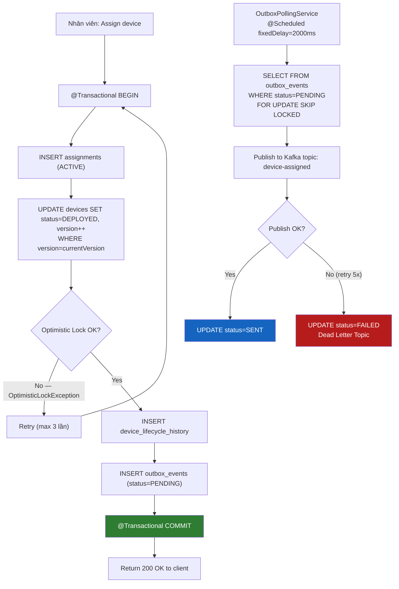
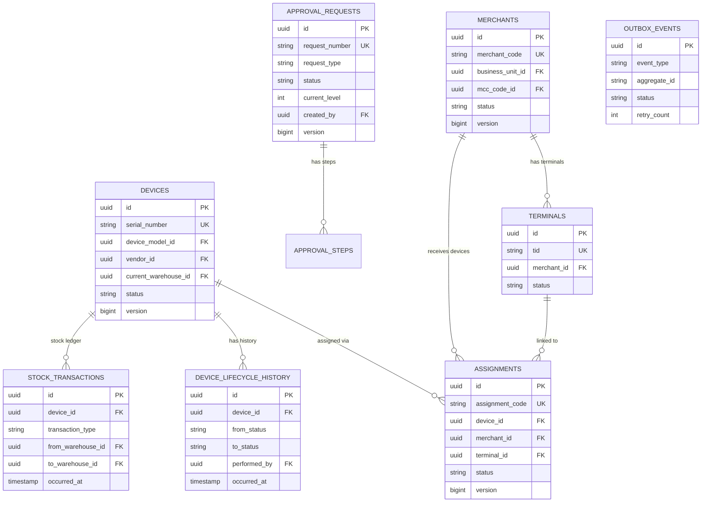

# 🖼️ POS Management System — Architecture Diagrams

> Bộ sơ đồ kiến trúc hệ thống POS Terminal & Merchant Management — Modular Monolith, Device Lifecycle FSM, Assignment Flow, Approval Workflow

---

## 1. System Topology (Tổng Quan Hệ Thống)



---

## 2. Device Lifecycle State Machine (FSM)



---

## 3. Clean Architecture — Hexagonal Architecture (Per Module)



---

## 4. Assignment Flow — Concurrent-Safe (Sequence Diagram)



---

## 5. Approval Workflow Flow



---

## 6. Data Scope Pattern — Business Unit Isolation



```java
// Trong mọi list query:
// DataScopeService inject businessUnitId
public Page<DeviceResponse> getDevices(DeviceFilter filter, Pageable pageable, UserPrincipal user) {
    // SUPER_ADMIN: businessUnitId = null → thấy tất cả
    // Các role khác: businessUnitId = user.getBusinessUnitId() → chỉ thấy dữ liệu của BU mình
    UUID businessUnitId = user.isSuperAdmin() ? null : user.getBusinessUnitId();
    return deviceRepository.findAllWithFilter(filter, businessUnitId, pageable)
        .map(mapper::toResponse);
}
```

---

## 7. Outbox Pattern — Transactional Reliability



---

## 8. Redis Key Strategy

| Use Case | Key Pattern | TTL | Type |
|---|---|---|---|
| JWT Refresh Token | `refresh:{tokenId}` | 7 ngày | String |
| Idempotency Assign | `idempotency:assign:{uuid}` | 10 phút | String |
| Idempotency Approval | `idempotency:approval:{uuid}` | 10 phút | String |
| Rate Limit Login | `rate_limit:login:{ip}` | 1 phút | Counter |
| Device Status Cache | `device:status:{serialNumber}` | 60 giây | String |
| Approval Inbox Count | `approval:inbox:{userId}` | 30 giây | String |
| Merchant Info Cache | `merchant:info:{merchantCode}` | 5 phút | String |
| Consumed Event | `consumed_event:{kafkaEventId}` | 1 giờ | String |
| Account Lock | `account:locked:{username}` | 30 phút | String |
| Distributed Lock | `device:assign:lock:{serial}` | 5 giây | Redisson RLock |

---

## 9. Database Schema ERD (Core Relationships)



---

*Tất cả diagram được tạo dựa trên thiết kế nghiệp vụ thực tế của POS Terminal & Merchant Management System*
