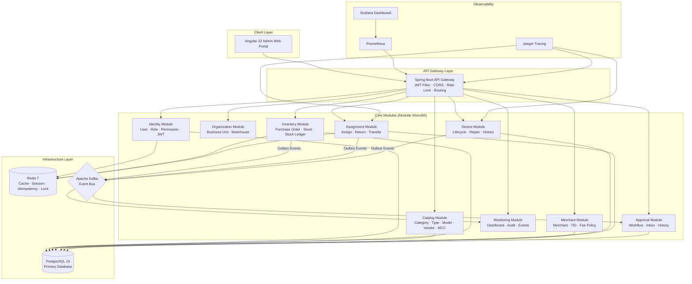
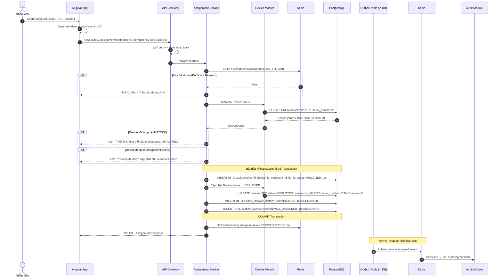
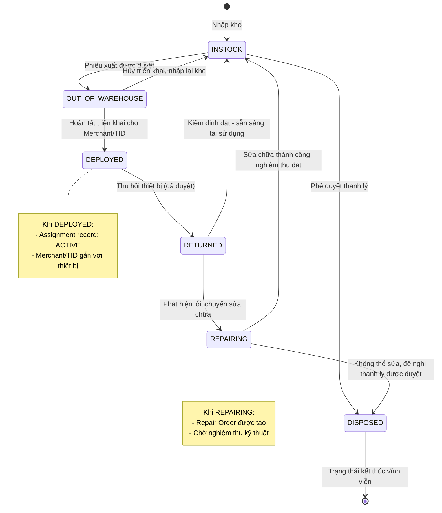
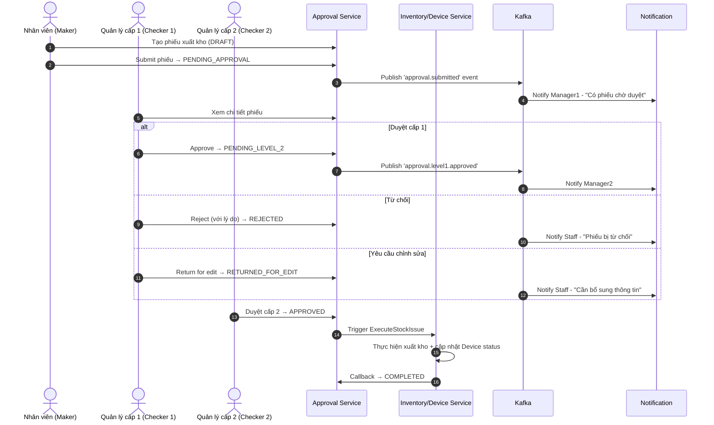

# POS Management System — Cẩm Nang Kiến Trúc (Architecture Bible)

Tài liệu này là kim chỉ nam kiến trúc không thay đổi trong suốt dự án. Mọi AI Agent và lập trình viên phải đọc tài liệu này trước khi viết bất kỳ dòng code nào.

---

## 1. Triết Lý Kiến Trúc (Architecture Philosophy)

> **"Không nhồi pattern vào vì nghe hay, chỉ áp dụng pattern khi giải quyết bài toán thực tế."**

| Bài Toán | Pattern Áp Dụng | Không Áp Dụng Nếu |
|---|---|---|
| Kafka fail sau DB commit | Transactional Outbox | Service đơn giản, không cần event |
| Hai nhân viên assign cùng thiết bị | Optimistic Lock + Unique Constraint | Read-only endpoint |
| Nhấn "Assign" hai lần | Idempotency Key | GET API |
| Approval cross-module | Saga Orchestration | Cùng một DB transaction |
| Đọc device history lớn | CQRS (Read Model) | Vài nghìn records |
| Multi Fee Provider | Strategy Pattern | Chỉ 1 loại phí |
| Session/Idempotency/Cache | Redis | Không cần TTL |
| Concurrent assignment | Redisson Distributed Lock | Không concurrent |

---

## 2. Lộ Trình Kiến Trúc Theo Phase (Phased Architecture)

### Phase 1 — Modular Monolith (Sprint 00–04)
Toàn bộ backend chạy trong **1 Spring Boot application**, chia theo **module/package** rõ ràng.

```
pos-management-backend (Spring Boot)
├── module: identity        (User, Role, Permission, Auth)
├── module: catalog         (Category, Type, Model, Vendor, MCC)
├── module: organization    (Business Unit, Warehouse)
├── module: inventory       (Purchase Order, Stock, Ledger)
├── module: merchant        (Merchant, TID, Fee Policy)
├── module: device          (Device Lifecycle, Repair)
├── module: assignment      (Assignment, Transfer, Return)
├── module: approval        (Workflow, Inbox, History)
├── module: monitoring      (Dashboard, Audit Log, Events)
└── module: admin           (User Mgmt, Role Mgmt, Config)
```

> **Lý do:** Học domain trước khi tách. Tránh distributed system complexity khi chưa vững domain knowledge.

### Phase 2 — Selective Microservices (Sprint 05–07)
Tách các service có load/team khác biệt:
- `approval-service` → Workflow engine độc lập
- `notification-service` → Kafka consumer độc lập
- `audit-service` → Append-only, scale riêng

### Phase 3 — Full Microservices (Sprint 08+)
- Tách toàn bộ module thành services độc lập
- Kubernetes, HPA, Service Mesh

---

## 3. Sơ Đồ Tổng Quan Hệ Thống (System Topology)



---

## 4. Kiến Trúc Nội Module (Intra-Module Architecture)

Mỗi module phải tuân theo **Clean Architecture / Hexagonal Architecture**:

```
module: assignment/
├── domain/                          # Lớp nghiệp vụ cốt lõi (Pure Java, KHÔNG có Spring/JPA)
│   ├── model/
│   │   ├── DeviceAssignment.java    # Aggregate Root
│   │   └── AssignmentStatus.java    # Enum trạng thái
│   ├── valueobject/
│   │   ├── SerialNumber.java        # Value Object — không để String rải rắc
│   │   ├── AssignmentId.java
│   │   └── MerchantCode.java
│   ├── service/
│   │   └── AssignmentDomainService.java  # Business rules
│   ├── repository/
│   │   └── AssignmentRepository.java     # Interface (Port)
│   ├── event/
│   │   ├── DeviceAssignedEvent.java
│   │   └── DeviceReturnedEvent.java
│   └── exception/
│       ├── DeviceAlreadyAssignedException.java
│       └── DeviceNotAssignableException.java
│
├── application/                     # Use Cases (Orchestration)
│   ├── usecase/
│   │   ├── CreateAssignmentUseCase.java
│   │   └── ReturnDeviceUseCase.java
│   ├── command/
│   │   └── CreateAssignmentCommand.java
│   └── service/
│       └── AssignmentApplicationService.java
│
├── infrastructure/                  # Adapters
│   ├── persistence/
│   │   ├── entity/
│   │   │   └── AssignmentJpaEntity.java
│   │   ├── mapper/
│   │   │   └── AssignmentMapper.java
│   │   └── repository/
│   │       └── AssignmentRepositoryAdapter.java
│   └── messaging/
│       └── publisher/
│           └── AssignmentEventPublisher.java
│
└── presentation/                    # REST Adapter
    ├── controller/
    │   └── AssignmentController.java
    └── dto/
        ├── request/
        │   └── CreateAssignmentRequest.java
        └── response/
            └── AssignmentResponse.java
```

### Quy Tắc Phụ Thuộc (Dependency Rule):
```
Presentation → Application → Domain ← Infrastructure
```
- **Domain** không import Spring, JPA, Kafka — thuần Java
- **Application** không import JPA Entity, không biết DB là gì
- **Infrastructure** implements interfaces của Domain
- **Presentation** chỉ gọi Application Use Case

---

## 5. Luồng Assignment Chi Tiết (Assignment Flow — Sequence Diagram)



---

## 6. Device Lifecycle State Machine



---

## 7. Approval Workflow Flow



---

## 8. Outbox Pattern — Reliable Messaging

```java
// Trong @Transactional Assignment Service:

// Bước 1: Lưu Assignment vào DB
assignmentRepository.save(assignment);

// Bước 2: Cập nhật Device status
deviceRepository.updateStatus(serialNumber, DeviceStatus.DEPLOYED);

// Bước 3: Ghi lifecycle history
lifecycleHistoryRepository.save(DeviceLifecycleHistory.of(
    device, DeviceStatus.INSTOCK, DeviceStatus.DEPLOYED, reason, performedBy
));

// Bước 4: Ghi Outbox Event (CÙNG TRANSACTION với bước 1, 2, 3)
outboxRepository.save(OutboxEvent.builder()
    .id(UUID.randomUUID())
    .eventType("DEVICE_ASSIGNED")
    .aggregateId(assignment.getId().toString())
    .payload(objectMapper.writeValueAsString(deviceAssignedEvent))
    .status(OutboxStatus.PENDING)
    .createdAt(Instant.now())
    .build());

// COMMIT tất cả 4 bước ở đây

// Bước 5 (Async - OutboxPollingService chạy mỗi 2s):
// SELECT FROM outbox_events WHERE status='PENDING' FOR UPDATE SKIP LOCKED
// → Publish Kafka → UPDATE status='SENT'
```

---

## 9. Concurrency Control — Assignment Race Condition

```java
// Vấn đề: Hai nhân viên cùng assign thiết bị SN-POS-000001

// Giải pháp 1: Optimistic Lock trên Device
@Version
private Long version;  // Trong DeviceJpaEntity

// UPDATE devices SET status='DEPLOYED', version=4
// WHERE serial_number='SN-POS-000001' AND version=3
// → Chỉ 1 request thành công, request còn lại → OptimisticLockException → Retry 3 lần

// Giải pháp 2: DB Unique Constraint
ALTER TABLE assignments
ADD CONSTRAINT uk_active_assignment
UNIQUE (device_id, status)  -- Chỉ cho ACTIVE status
-- Hoặc: Partial unique index
CREATE UNIQUE INDEX idx_one_active_assignment
ON assignments(device_id)
WHERE status = 'ACTIVE';
-- → Chỉ 1 assignment ACTIVE tại một thời điểm

// Giải pháp 3: Distributed Lock (Redisson)
RLock lock = redissonClient.getLock("device:assign:lock:" + serialNumber);
lock.lock(5, TimeUnit.SECONDS);
try { /* business logic */ } finally { lock.unlock(); }
```

---

## 10. Module Dependencies & Boundaries

```
identity-module
  └── provides: SecurityContext (userId, roles, businessUnitId)
  └── no dependency on other modules

catalog-module
  └── depends on: identity-module
  └── provides: DeviceModel, Vendor, MCC, FeePolicy reference data

organization-module
  └── depends on: identity-module
  └── provides: BusinessUnit, Warehouse

inventory-module
  └── depends on: identity-module, catalog-module, organization-module
  └── publishes: DeviceReceivedEvent, StockIssuedEvent, StockTransferredEvent

merchant-module
  └── depends on: identity-module, catalog-module, organization-module
  └── publishes: MerchantCreatedEvent, TerminalStatusChangedEvent

device-module
  └── depends on: identity-module, catalog-module, organization-module, inventory-module
  └── publishes: DeviceLifecycleChangedEvent, DeviceRepairEvent

assignment-module
  └── depends on: identity-module, merchant-module, device-module
  └── publishes: DeviceAssignedEvent, DeviceReturnedEvent, DeviceTransferredEvent

approval-module
  └── consumes Kafka events: inventory events, assignment events
  └── publishes: ApprovalCompletedEvent, ApprovalRejectedEvent

monitoring-module
  └── consumes ALL domain events
  └── write-only audit, no outgoing dependencies
```

---

## 11. Redis Usage Map

| Use Case | Key Pattern | TTL | Data Structure |
|---|---|---|---|
| JWT Session | `session:{userId}` | 15m | Hash |
| Refresh Token | `refresh:{tokenId}` | 7 days | String |
| Idempotency (Assign) | `idempotency:assign:{key}` | 10 min | String |
| Idempotency (Approval) | `idempotency:approval:{key}` | 10 min | String |
| Rate Limit | `rate_limit:{userId}:{api}` | 1 min | Counter |
| Device Status Cache | `device:status:{serialNumber}` | 60s | String |
| Approval Inbox Count | `approval:inbox:{userId}` | 30s | String |
| Distributed Lock | `device:assign:lock:{serialNumber}` | 5s | String (Redisson) |

---

## 12. API Convention

```
GET    /api/v1/{resource}              # Danh sách (có pagination, filter)
GET    /api/v1/{resource}/{id}         # Chi tiết
POST   /api/v1/{resource}             # Tạo mới
PUT    /api/v1/{resource}/{id}         # Cập nhật toàn bộ
PATCH  /api/v1/{resource}/{id}/{action} # Thay đổi trạng thái
DELETE /api/v1/{resource}/{id}         # Xóa (soft delete nếu có)

# Ví dụ:
POST   /api/v1/assignments             # Cấp phát thiết bị
PATCH  /api/v1/devices/{sn}/return     # Thu hồi thiết bị
POST   /api/v1/approvals/{id}/approve  # Phê duyệt
POST   /api/v1/approvals/{id}/reject   # Từ chối
GET    /api/v1/devices/{sn}/lifecycle  # Lịch sử vòng đời
```

---

## 13. Security Architecture

```
Layer 1 - Network: HTTPS only, CORS configuration
Layer 2 - Gateway: JWT validation, Rate Limiting (5 req/s per user)
Layer 3 - Service: Spring Security RBAC (@PreAuthorize("hasRole('INVENTORY_MANAGER')"))
Layer 4 - Data Scope: Business Unit filter trong mọi query
Layer 5 - DB: Parameterized queries (no SQL injection)
Layer 6 - Audit: Immutable audit trail mọi hành động nhạy cảm
Layer 7 - Sensitive Data: Mask Serial, TID trong logs
```

### JWT Flow:
```
Login → Access Token (15 phút) + Refresh Token (7 ngày, lưu Redis)
→ Access Token expired → Gửi Refresh Token → Nhận cặp token mới
→ Refresh Token Rotation: Token cũ bị vô hiệu hóa ngay sau khi đổi
```

---

## 14. External System Integrations

### 14.1 WAY4 — Card Management Platform

WAY4 là platform quản lý thẻ của OpenWay Group, sử dụng trong nhiều ngân hàng Việt Nam.
POS Management tích hợp với WAY4 để đồng bộ TID/MID và trạng thái thiết bị.

```
Integration Points:
├── TID Registration: Khi TID được kích hoạt, đồng bộ sang WAY4
├── MID Mapping: Ánh xạ POS MID với WAY4 Merchant Contract
├── Device Status Sync: Khi thiết bị DEPLOYED/RETURNED, cập nhật WAY4
├── Transaction Routing: WAY4 routing giao dịch theo TID → về đúng MID (1 MID → N TID)
└── Settlement Data: Nhận dữ liệu quyết toán từ WAY4

Integration Pattern: REST Client (Spring RestClient — không dùng RestTemplate)
Error Handling: Circuit Breaker (Resilience4j) + Retry với Exponential Backoff
Data Mapping:
  device_models.way4_model_code  ↔  WAY4 Terminal Profile Code
  terminal_ids.way4_tid          ↔  WAY4 Terminal ID
  merchant_ids.way4_mid          ↔  WAY4 Merchant Contract ID (MID gắn N TID)
  merchants.way4_merchant_id     ↔  WAY4 Merchant ID (parent của MID)
```

### 14.2 T24 — Temenos Core Banking

T24 là hệ thống Core Banking phổ biến nhất Việt Nam (Techcombank, MB Bank...).
POS Management tích hợp để liên kết Merchant với tài khoản ngân hàng.

```
Integration Points:
├── Customer Lookup: Lấy thông tin khách hàng từ T24 khi onboard Merchant
├── Account Validation: Xác thực tài khoản thanh toán của Merchant
├── Fee Settlement: Ghi phí dịch vụ vào tài khoản qua T24
└── Merchant Credit: Cập nhật hạn mức cho Merchant từ T24

Integration Pattern: REST Client + Async via Kafka (for non-blocking fee settlement)
Data Mapping:
  merchants.t24_customer_id      ↔  T24 Customer ID
  merchant_ids.t24_account_id    ↔  T24 Account Number
  device_models.t24_product_code ↔  T24 Product Code
```

### 14.3 Nguyên Tắc Integration

```java
// ĐÚNG: Dùng Spring RestClient (Spring 6+) — KHÔNG dùng RestTemplate
@Service
public class Way4IntegrationService {
    private final RestClient restClient;

    public Way4IntegrationService(RestClient.Builder builder,
                                   @Value("${pos.way4.base-url}") String baseUrl) {
        this.restClient = builder.baseUrl(baseUrl).build();
    }

    @CircuitBreaker(name = "way4")
    @Retry(name = "way4")
    public void registerTid(String tid, String modelCode) {
        restClient.post()
            .uri("/terminals/register")
            .body(new Way4TidRegistrationRequest(tid, modelCode))
            .retrieve()
            .toBodilessEntity();
    }
}
```

---

## 15. Frontend Architecture (BOF — Back Office Frontend)

Hệ thống có 2 loại frontend:

```
pos-management/
├── frontend/           # BOF (Back Office Frontend) — Angular 22
│   ├── src/app/
│   │   ├── core/       # Auth, Guards, Interceptors, Models
│   │   ├── shared/     # Reusable components, pipes, directives
│   │   └── features/   # Feature modules (catalog, inventory, merchant...)
│   └── package.json
```

### Angular Folder Convention (mỗi feature):
```
features/catalog/
├── components/         # Presentation components
│   ├── category-list/
│   ├── category-form/
│   └── category-detail/
├── services/           # Feature-specific API calls
│   └── catalog.service.ts
├── models/             # Feature DTOs/interfaces
│   └── catalog.model.ts
└── catalog.routes.ts   # Lazy-loaded routes
```

---

## 16. Database Conventions — BẮTT BUỘC

### 16.1 Cột bắt buộc trên MỌI bảng nghiệp vụ:

```sql
-- Mỗi bảng nghiệp vụ PHẢI có:
version     BIGINT NOT NULL DEFAULT 0,   -- Optimistic Lock
metadata    JSONB,                        -- Thuộc tính mở rộng chưa chuẩn hóa
created_at  TIMESTAMP WITH TIME ZONE NOT NULL DEFAULT CURRENT_TIMESTAMP,
updated_at  TIMESTAMP WITH TIME ZONE NOT NULL DEFAULT CURRENT_TIMESTAMP,
created_by  UUID REFERENCES users(id),   -- Ai tạo
updated_by  UUID REFERENCES users(id)    -- Ai cập nhật cuối
```

Lý do:
- `version`: Optimistic Locking — phát hiện concurrent modification không cần SELECT FOR UPDATE
- `metadata JSONB`: Lưu thuộc tính mở rộng tạm thời, không cần thêm cột ngay
- `created_by/updated_by`: Audit trail ai làm gì, khi nào

### 16.2 Serial Number áp dụng theo Device Model:

```
ĐÚNG:
  device_models.serial_prefix = 'PAX-A920'
  → Thiết bị của model PAX A920: PAX-A920-000001, PAX-A920-000002, ...

SAI:
  Mỗi device tự define serial format riêng
```

### 16.3 Quy tắc Active/Inactive Device Model:

```
KHÔNG được phép thay đổi is_active = FALSE nếu:
  - Còn device nào có model_id = device_model.id
    VÀ device.status IN ('INSTOCK', 'DEPLOYED', 'REPAIRING', 'OUT_OF_WAREHOUSE')

Enforce bằng:
  1. Application logic (Service layer validation)
  2. Database trigger (safety net)
```

---

## 17. Tech Stack — Phiên Bản Mục Tiêu

| Thành phần | Hiện tại (Stable) | Mục tiêu |
|---|---|---|
| Java | 21 LTS | Java 25 (khi GA) |
| Spring Boot | 3.4.x | Spring Boot 4.1 (khi GA) |
| Spring Framework | 6.x | Spring Framework 7 (khi GA) |
| HTTP Client | RestClient (Spring 6.1+) | RestClient (Spring 7) |
| Angular | 22 | 22+ |
| PostgreSQL | 16 | 16+ |
| Kafka | 3.x | 3.x+ |
| Redis | 7 | 7+ |

> **Lưu ý:** Spring Boot 4.1 và Java 25 chưa được phát hành tại thời điểm viết tài liệu này.
> Dùng Spring Boot 3.4.x + Java 21 LTS cho môi trường production.
> Code design đảm bảo có thể upgrade lên khi các phiên bản đó GA.
