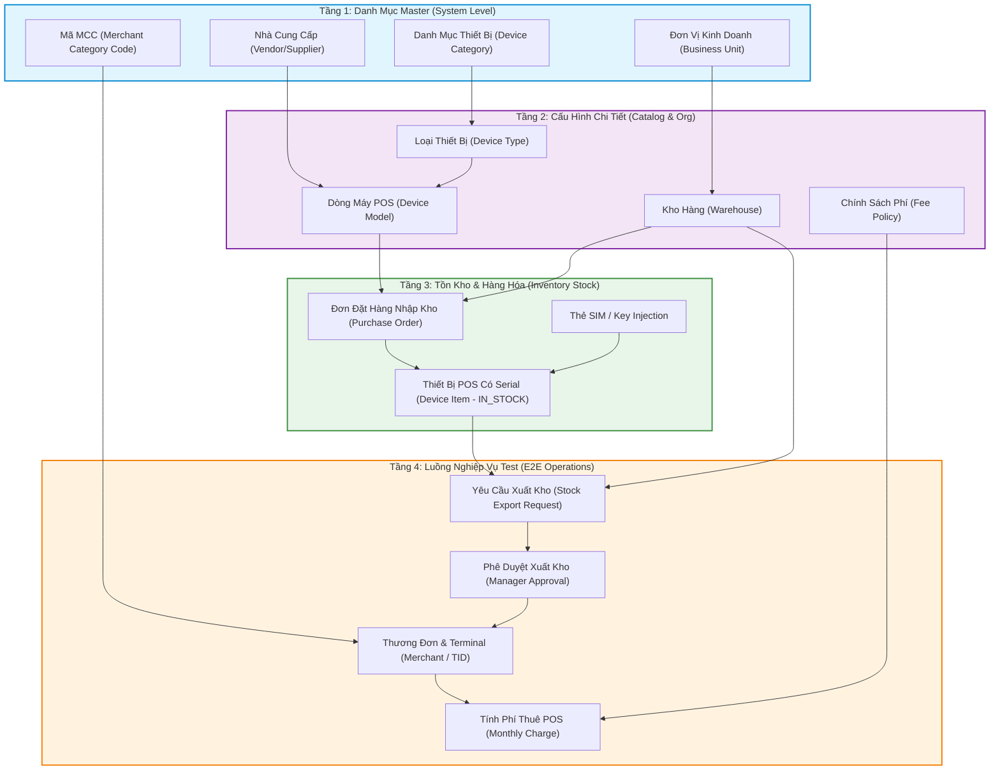
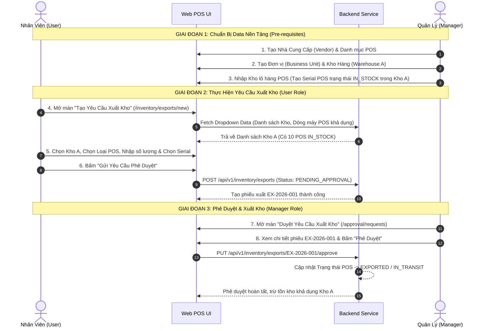

# HƯỚNG DẪN TẠO DỮ LIỆU TEST HỆ THỐNG POS MANAGEMENT SYSTEM (E2E TEST DATA SETUP GUIDE)

> **Mục tiêu**: Tài liệu này hướng dẫn chi tiết cách khởi tạo dữ liệu để test các luồng nghiệp vụ end-to-end (E2E) trong hệ thống **POS Management System**, giải thích rõ thứ tự bắt buộc (Dependencies), ma trận vai trò (User vs Manager), và ví dụ thực hành từng bước cho luồng **Yêu cầu Xuất kho Thiết bị POS**.

---

## 📋 TỔNG QUAN & THỨ TỰ BẮT BUỘC KHỞI TẠO DỮ LIỆU (DATA DEPENDENCIES)

Trong hệ thống quản lý POS doanh nghiệp, một giao dịch nghiệp vụ (như *Xuất kho*, *Điều chuyển*, hay *Gán thiết bị cho Merchant*) không thể hoạt động độc lập nếu thiếu dữ liệu nền tảng. Các dropdown lookup trên giao diện phụ thuộc trực tiếp vào các dữ liệu Master đã được tạo trước đó.

### Sơ đồ Cây Phụ Thuộc Dữ Liệu (Data Hierarchy Graph)



---

## 👥 MA TRẬN VÀI TRÒ & TÀI KHOẢN TEST (ROLES & PERMISSIONS)

Khi thực hiện test, bạn cần phân biệt rõ trách nhiệm giữa 2 vai trò:

| Phân Vùng | User (Nhân viên Kho / Chuyên viên KD) | Manager (Quản lý Kho / Trưởng phòng) |
| :--- | :--- | :--- |
| **Quyền hạn chính** | - Lập Đơn Nhập kho / Yêu cầu Xuất kho<br>- Tra cứu tồn kho thiết bị<br>- Yêu cầu điều chuyển kho<br>- Tạo phiếu hỗ trợ sự cố (Ticket) | - Phê duyệt / Từ chối Đơn Nhập & Đơn Xuất kho<br>- Cấu hình Danh mục Master & Nhà cung cấp<br>- Xem báo cáo KPI & Dashboard quản trị |
| **Tài khoản test UI** | `staff_user_01` (Pass: `123456`) | `manager_user_01` (Pass: `123456`) |
| **Role Code** | `ROLE_WAREHOUSE_STAFF` / `ROLE_POS_OFFICER` | `ROLE_WAREHOUSE_MANAGER` / `ROLE_ADMIN` |

> [!TIP]
> **Kinh nghiệm Test**: Nên mở 2 trình duyệt độc lập (Ví dụ: **Chrome** đăng nhập `User` để thao tác gửi yêu cầu, **Edge / Incognito** đăng nhập `Manager` để mở danh sách chờ phê duyệt). Việc này giúp test nhanh luồng chuyển trạng thái Realtime mà không phải Logout/Login liên tục.

---

## 🔄 LUỒNG CHI TIẾT: YÊU CẦU XUẤT KHO THIẾT BỊ POS (POS EXPORT FLOW)

Đây là luồng nghiệp vụ phổ biến nhất. Để thực hiện **Tạo Yêu cầu Xuất kho**, thiết bị POS phải **đã tồn tại trong kho** ở trạng thái **Sẵn sàng (IN_STOCK)** và Kho hàng xuất phải có đủ số lượng.

### Sơ đồ Luồng Thực Hiện Test (Sequence Diagram)



---

## 🛠️ HƯỚNG DẪN TẠO DATA CỤ THỂ TỪNG BƯỚC (STEP-BY-STEP)

### BƯỚC 1: Đảm bảo Nhà cung cấp & Danh mục POS tồn tại (Lookup Dropdown)

Nếu màn hình Tạo phiếu xuất hoặc Tạo dòng máy không hiển thị Nhà cung cấp trong dropdown, bạn cần khởi tạo dữ liệu này trước.

#### Thao tác trên UI:
1. Đăng nhập quyền **Manager** (`/login`).
2. Vào menu **Quản lý Danh mục** -> **Nhà cung cấp** (`/catalog/vendors`):
   - Click **Tạo Nhà Cung Cấp**.
   - *Mã NCC*: `VENDOR_INGENICO`
   - *Tên NCC*: `Công ty Ingenico Việt Nam`
   - *Trạng thái*: `Đang hoạt động (ACTIVE)`
3. Vào menu **Danh mục Thiết bị** (`/catalog/categories`):
   - *Mã*: `CAT_POS_SMART` | *Tên*: `Thiết bị Smart POS Android`
4. Vào menu **Loại Thiết bị** (`/catalog/types`):
   - *Mã*: `TYPE_POS_DESK` | *Tên*: `Thiết bị POS Đặt bàn (Desktop POS)`
5. Vào menu **Dòng Máy POS (Device Model)** (`/catalog/models`):
   - Click **Tạo Dòng Máy**.
   - *Mã Model*: `MODEL_A920`
   - *Tên Model*: `Pax A920 Smart POS`
   - *Nhà cung cấp*: Chọn `Ingenico Việt Nam`
   - *Danh mục*: Chọn `Smart POS Android`

---

### BƯỚC 2: Đảm bảo Đơn vị & Kho hàng tồn tại (Org & Warehouse)

Để có kho xuất hàng chọn trên dropdown:

#### Thao tác trên UI:
1. Vào menu **Quản lý Tổ chức** -> **Đơn vị Kinh doanh** (`/organization/business-units`):
   - *Mã Đơn vị*: `BU_HCM_01` | *Tên*: `Chi nhánh TP.Hồ Chí Minh`
2. Vào menu **Quản lý Kho Hàng** (`/organization/warehouses`):
   - Click **Thêm Kho Hàng**.
   - *Mã Kho*: `WH_HCM_CENTRAL`
   - *Tên Kho*: `Kho Trung Tâm TP.HCM`
   - *Thuộc Đơn vị*: `Chi nhánh TP.Hồ Chí Minh`
   - *Trạng thái*: `Hoạt động`

---

### BƯỚC 3: Tạo Tồn Kho Thiết Bị POS (Có Serial Number - State: IN_STOCK)

Đây là bước quan trọng nhất. Nếu kho trống (0 thiết bị), màn hình yêu cầu xuất kho sẽ không thể chọn thiết bị để xuất.

#### Cách 1: Tạo qua Giao diện Nhập Kho (UI Workflow)
1. Vào menu **Quản lý Tồn kho** -> **Nhập Kho Thiết Bị** (`/inventory/imports/new`).
2. Chọn *Kho nhập*: `Kho Trung Tâm TP.HCM (WH_HCM_CENTRAL)`.
3. Chọn *Nhà cung cấp*: `Công ty Ingenico Việt Nam`.
4. Nhập danh sách Serial thiết bị:
   - Serial 1: `SN-POS-2026-001` (Model: `Pax A920 Smart POS`)
   - Serial 2: `SN-POS-2026-002` (Model: `Pax A920 Smart POS`)
   - Serial 3: `SN-POS-2026-003` (Model: `Pax A920 Smart POS`)
5. Nhấp **Hoàn tất Nhập kho**. Trạng thái các máy này trên hệ thống sẽ là `IN_STOCK`.

#### Cách 2: Chạy Script SQL Tạo Fast Data (Dành cho Dev / Tester)
Nếu muốn tạo nhanh data trong Database PostgreSQL/MySQL mà không cần bấm tay nhiều màn:

```sql
-- 1. Insert Master Catalog
INSERT INTO catalog_vendor (id, code, name, status, created_at) 
VALUES ('v-01', 'VENDOR_INGENICO', 'Công ty Ingenico Việt Nam', 'ACTIVE', NOW())
ON CONFLICT (code) DO NOTHING;

INSERT INTO catalog_device_category (id, code, name, status) 
VALUES ('cat-01', 'CAT_POS_SMART', 'Smart POS Android', 'ACTIVE')
ON CONFLICT (code) DO NOTHING;

INSERT INTO catalog_device_type (id, code, name, category_id, status) 
VALUES ('type-01', 'TYPE_POS_DESK', 'POS Đặt Bàn', 'cat-01', 'ACTIVE')
ON CONFLICT (code) DO NOTHING;

INSERT INTO catalog_device_model (id, code, name, vendor_id, type_id, status) 
VALUES ('mod-01', 'MODEL_A920', 'Pax A920 Smart POS', 'v-01', 'type-01', 'ACTIVE')
ON CONFLICT (code) DO NOTHING;

-- 2. Insert Warehouse & Business Unit
INSERT INTO org_business_unit (id, code, name, status) 
VALUES ('bu-01', 'BU_HCM_01', 'Chi nhánh TP.Hồ Chí Minh', 'ACTIVE')
ON CONFLICT (code) DO NOTHING;

INSERT INTO org_warehouse (id, code, name, business_unit_id, status) 
VALUES ('wh-01', 'WH_HCM_CENTRAL', 'Kho Trung Tâm TP.HCM', 'bu-01', 'ACTIVE')
ON CONFLICT (code) DO NOTHING;

-- 3. Insert Thiết bị POS sẵn sàng xuất (IN_STOCK)
INSERT INTO inv_device (id, serial_number, model_id, warehouse_id, status, created_at)
VALUES 
  ('dev-101', 'SN-POS-2026-001', 'mod-01', 'wh-01', 'IN_STOCK', NOW()),
  ('dev-102', 'SN-POS-2026-002', 'mod-01', 'wh-01', 'IN_STOCK', NOW()),
  ('dev-103', 'SN-POS-2026-003', 'mod-01', 'wh-01', 'IN_STOCK', NOW())
ON CONFLICT (serial_number) DO NOTHING;
```

---

### BƯỚC 4: Thực Hiện Luồng Test "Yêu Cầu Xuất Kho" (User Role)

Bây giờ bạn đã có đầy đủ tiền đề data, hãy tiến hành test luồng chính:

1. Đăng nhập tài khoản **User** (`staff_user_01`).
2. Truy cập màn hình **Tạo Yêu Cầu Xuất Kho** (`/inventory/exports/new`).
3. Kiểm tra các ô Dropdown Lookup:
   - Ô **Kho Xuất**: Chọn `Kho Trung Tâm TP.HCM (WH_HCM_CENTRAL)` *(Dữ liệu lấy từ Bước 2)*.
   - Ô **Mục đích xuất**: Chọn `Xuất cấp cho Merchant mới` hoặc `Xuất thay thế bảo hành`.
   - Ô **Dòng máy POS**: Chọn `Pax A920 Smart POS` *(Dữ liệu lấy từ Bước 1)*.
4. Chọn danh sách thiết bị xuất:
   - Hệ thống hiển thị danh sách Serial khả dụng ở Kho HCM: Chọn `SN-POS-2026-001` và `SN-POS-2026-002` *(Dữ liệu lấy từ Bước 3)*.
5. Nhấp **Tạo Yêu Cầu Xuất Kho**.
6. **Kết quả mong đợi**:
   - Hệ thống thông báo tạo phiếu thành công với Mã phiếu: `EX-2026-001`.
   - Trạng thái phiếu: `PENDING_APPROVAL` (Chờ phê duyệt).
   - Trạng thái tạm thời của 2 thiết bị POS chuyển sang: `RESERVED_FOR_EXPORT` (Đã giữ chỗ, không cho đơn khác chọn trùng).

---

### BƯỚC 5: Thực Hiện Luồng "Phê Duyệt Xuất Kho" (Manager Role)

1. Chuyển sang trình duyệt/tài khoản **Manager** (`manager_user_01`).
2. Truy cập **Danh sách Yêu cầu Xuất kho** (`/inventory/exports`) hoặc **Trung tâm Phê duyệt** (`/approval/requests`).
3. Đóng vai trò Trưởng phòng Kho:
   - Mở chi tiết phiếu `EX-2026-001`.
   - Kiểm tra thông tin: Người yêu cầu, Kho xuất, Danh sách 2 Serial POS.
   - Nhấp nút **Phê Duyệt (Approve)** và nhập lý do: *"Đồng ý xuất cấp POS cho Chi nhánh HCM"*.
4. **Kết quả mong đợi**:
   - Phiếu xuất chuyển trạng thái thành `APPROVED` / `COMPLETED`.
   - Tồn kho khả dụng của `WH_HCM_CENTRAL` giảm đi 2.
   - Trạng thái 2 thiết bị POS `SN-POS-2026-001` & `SN-POS-2026-002` chuyển thành `EXPORTED` (Đã xuất kho).

---

## 📌 CHEAT SHEET: BẢNG TRA CỨU TIỀN ĐỀ CHO CÁC LUỒNG TEST KHÁC

Dưới đây là danh sách tổng hợp điều kiện cần trước khi test các màn hình khác trong hệ thống:

| Màn Hình Muốn Test | Điều Kiện Dữ Liệu Cần Có Trước (Prerequisites) | Màn Hình Tạo Data Tiền Đề |
| :--- | :--- | :--- |
| **Gán POS cho Merchant (Terminal Assignment)** | 1. Merchant & TID khả dụng<br>2. Thiết bị POS ở trạng thái `EXPORTED` hoặc `READY_FOR_INSTALL` | 1. Quản lý Merchant (`/merchant/list`)<br>2. Phiếu xuất kho đã duyệt (`/inventory/exports`) |
| **Nạp Thẻ SIM cho POS** | 1. Thẻ SIM ở trạng thái `AVAILABLE`<br>2. Thiết bị POS khả dụng | 1. Quản lý SIM (`/telecom/sims`)<br>2. Quản lý Thiết bị (`/inventory/devices`) |
| **Nạp Key An Ninh (Key Injection)** | 1. Phiếu Yêu cầu Inject Key ở trạng thái `APPROVED`<br>2. Thiết bị POS chuẩn bị nạp key | 1. Quản lý Key Injection (`/security/key-injection`) |
| **Bảo Hành / Sửa Chữa POS** | 1. Thiết bị POS ở trạng thái `ASSIGNED` hoặc `FAULTY`<br>2. Nhà cung cấp dịch vụ sửa chữa | 1. Tra cứu Thiết bị (`/inventory/device-lookup`)<br>2. Danh mục NCC (`/catalog/vendors`) |
| **Tính Phí Thuê POS Hàng Tháng** | 1. Merchant đang gắn POS có phát sinh giao dịch<br>2. Chính sách phí (Fee Policy) đang Active | 1. Chính sách Phí (`/finance/rental-policies`)<br>2. Gán Terminal (`/merchant/terminals`) |

---

## 💡 LƯU Ý KHI GẶP LỖI THIẾU DATA TRÊN DROPDOWN (TROUBLESHOOTING)

- **Lỗi 1: Ô Dropdown Chọn Kho bị trống (Empty)**
  - *Nguyên nhân*: Chưa có kho nào ở trạng thái `ACTIVE` hoặc User đang login không được phân quyền thuộc Đơn vị (Business Unit) sở hữu kho đó.
  - *Khắc phục*: Kiểm tra màn `/organization/warehouses`, đảm bảo kho bật công tắc `Active`.

- **Lỗi 2: Chọn Kho xuất xong nhưng Danh sách Serial POS bị rỗng**
  - *Nguyên nhân*: Trong kho đó chưa có máy POS nào có trạng thái `IN_STOCK` (có thể máy đang ở trạng thái `RESERVED`, `BROKEN`, hoặc đã `ASSIGNED`).
  - *Khắc phục*: Vào màn Tra cứu Thiết bị (`/inventory/device-lookup`), lọc theo Kho đó và kiểm tra cột Trạng thái. Nếu không có máy `IN_STOCK`, hãy thực hiện Nhập kho thêm ở Bước 3.

- **Lỗi 3: Nút "Tạo Phiếu Xuất Kho" bị vô hiệu hóa (Disabled)**
  - *Nguyên nhân*: Chưa chọn đủ thông tin bắt buộc (Kho xuất, Mục đích, hoặc Danh sách Serial chọn = 0).
